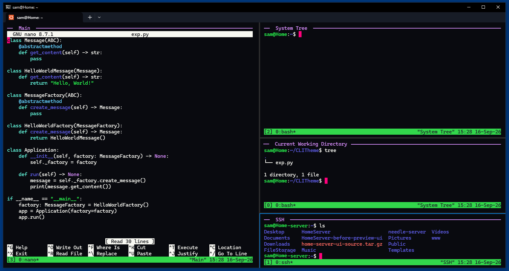
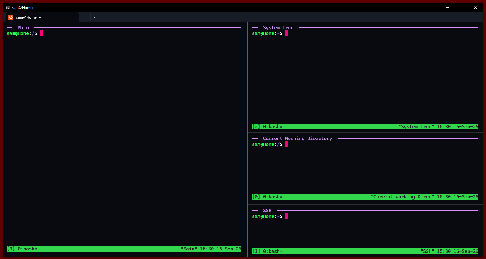

# Neon Dark Windows Terminal Theme



A custom Windows Terminal configuration designed specifically for **WSL users running Linux inside Windows Terminal**.

The theme uses a deep navy-black background, bright high-contrast text, a hot-pink block cursor, a neon ANSI color palette, a clean four-pane workspace, and optional `tmux` pane titles.

> **Important:** This configuration was made for Windows Terminal with WSL. It is not intended for the legacy standalone Command Prompt window.

## Features

- Designed for WSL inside Windows Terminal
- Background: `#090A0F`
- Foreground: `#F8F8F2`
- Hot-pink block cursor: `#FF007C`
- Neon ANSI color palette
- Cascadia Mono
- Hidden scrollbars
- Four-pane startup workspace
- `Ctrl + Shift + T` opens another four-pane workspace
- Matching `tmux` configuration with persistent pane titles
- Sanitized `settings.json` with no usernames, personal paths, or machine-specific profile GUIDs

## Requirements

- Windows 10 or Windows 11
- [Windows Terminal](https://learn.microsoft.com/en-us/windows/terminal/install)
- Windows Subsystem for Linux (WSL)
- A WSL Linux distribution such as Ubuntu
- `tmux`

## Install tmux

Open your WSL shell.

### Ubuntu / Debian

```bash
sudo apt update
sudo apt install tmux
```

### Fedora

```bash
sudo dnf install tmux
```

### Arch Linux

```bash
sudo pacman -S tmux
```

### Alpine Linux

```bash
sudo apk add tmux
```

Verify the installation:

```bash
tmux -V
```

## Install the Windows Terminal Theme

### 1. Back up your current configuration

Open Windows Terminal and press:

```text
Ctrl + Shift + ,
```

This opens the active `settings.json`.

Save a copy of your current configuration before replacing it.

The Stable Windows Terminal settings file is normally located at:

```text
%LOCALAPPDATA%\Packages\Microsoft.WindowsTerminal_8wekyb3d8bbwe\LocalState\settings.json
```

Other documented locations include:

**Windows Terminal Preview**

```text
%LOCALAPPDATA%\Packages\Microsoft.WindowsTerminalPreview_8wekyb3d8bbwe\LocalState\settings.json
```

**Windows Terminal Canary**

```text
%LOCALAPPDATA%\Packages\Microsoft.WindowsTerminalCanary_8wekyb3d8bbwe\LocalState\settings.json
```

**Unpackaged Windows Terminal**

```text
%LOCALAPPDATA%\Microsoft\Windows Terminal\settings.json
```

### 2. Apply `settings.json`

Replace the contents of your Windows Terminal `settings.json` with the `settings.json` from this repository.

Save the file, close all Windows Terminal windows, and reopen Windows Terminal.

The configuration creates a clean four-pane workspace:

```text
┌────────────────────────┬────────────────────────┐
│                        │                        │
│                        │                        │
│                        ├────────────────────────┤
│                        │                        │
│                        ├────────────────────────┤
│                        │                        │
└────────────────────────┴────────────────────────┘
```

Each pane uses your current/default Windows Terminal profile.

### 3. Install the tmux configuration

Copy `.tmux.conf` from this repository into your WSL home directory:

```bash
cp /path/to/repo/.tmux.conf ~/.tmux.conf
```

Then start tmux:

```bash
tmux
```

If tmux is already running:

```bash
tmux source-file ~/.tmux.conf
```

## Persistent tmux Pane Titles

The included `.tmux.conf` displays each tmux pane title along its top border.

Set the current pane title with:

```bash
tmux select-pane -T "MAIN"
```

Examples:

```bash
tmux select-pane -T "CODE"
tmux select-pane -T "SERVER"
tmux select-pane -T "SSH"
```

The title remains visible while commands and terminal applications run inside that pane.

## Opening Another Four-Pane Workspace

Press:

```text
Ctrl + Shift + T
```

The included Windows Terminal action opens another tab with the same four-pane layout.

## Example in Use



## Color Palette

| Element | Color |
|---|---|
| Background | `#090A0F` |
| Foreground | `#F8F8F2` |
| Cursor | `#FF007C` |
| Selection | `#293040` |
| Black | `#1C1E26` |
| Red | `#FF453A` |
| Green | `#32D74B` |
| Yellow | `#FFD60A` |
| Blue | `#0A84FF` |
| Purple | `#BF5AF2` |
| Cyan | `#64D2FF` |
| White | `#E5E5EA` |
| Bright Black | `#6B7089` |
| Bright Red | `#FF6961` |
| Bright Green | `#29FF50` |
| Bright Yellow | `#FFE620` |
| Bright Blue | `#5E5CE6` |
| Bright Purple | `#DA8FFF` |
| Bright Cyan | `#66FFE3` |
| Bright White | `#FFFFFF` |

## Font

The configuration uses:

```text
Cascadia Mono
```

at size:

```text
12
```

## Restoring Your Previous Settings

1. Close Windows Terminal.
2. Restore your backed-up `settings.json`.
3. Reopen Windows Terminal.

## Existing Custom Configurations

Replacing `settings.json` replaces your current Windows Terminal configuration.

If you already have profiles, keybindings, themes, or other settings you want to keep, manually merge the relevant sections instead of replacing the entire file.

The main sections used by this theme are:

```text
actions
keybindings
profiles.defaults
schemes
themes
startupActions
```

## Social Preview

`assets/social-preview.png` is formatted for the GitHub repository social preview.

Upload it from:

**Repository → Settings → Social preview → Edit → Upload an image**

## Documentation

- [Windows Terminal](https://learn.microsoft.com/en-us/windows/terminal/)
- [Windows Terminal installation](https://learn.microsoft.com/en-us/windows/terminal/install)
- [Windows Terminal actions](https://learn.microsoft.com/en-us/windows/terminal/customize-settings/actions)
- [Windows Terminal themes](https://learn.microsoft.com/en-us/windows/terminal/customize-settings/themes)
- [WSL documentation](https://learn.microsoft.com/en-us/windows/wsl/)

## License

MIT. See [LICENSE](LICENSE).
